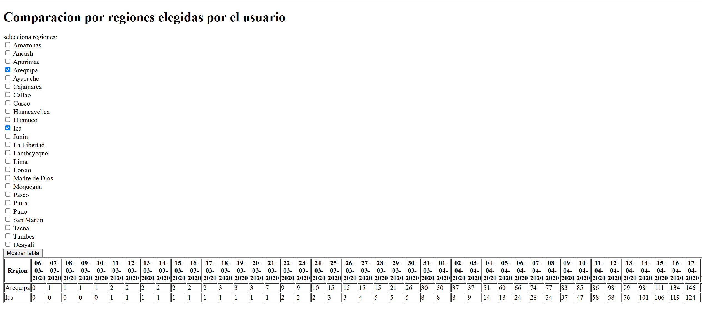
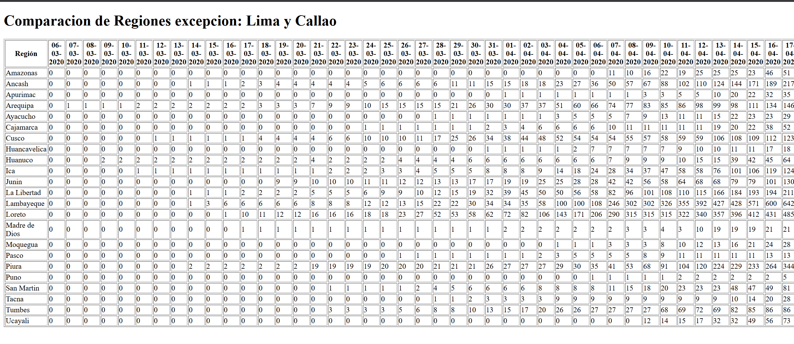

<div align="center">

<table>
    <theader>
        <tr>
            <td></td>
            <th>
                <span style="font-weight:bold;">UNIVERSIDAD NACIONAL DE SAN AGUSTIN</span><br />
                <span style="font-weight:bold;">FACULTAD DE INGENIERÍA DE PRODUCCIÓN Y SERVICIOS</span><br />
                <span style="font-weight:bold;">DEPARTAMENTO ACADÉMICO DE INGENIERÍA DE SISTEMAS E INFORMÁTICA</span><br />
                <span style="font-weight:bold;">ESCUELA PROFESIONAL DE INGENIERÍA DE SISTEMAS</span>
            </th>
            <td></td>
        </tr>
    </theader>
    <tbody>
        <tr><td colspan="3"><span style="font-weight:bold;">Formato</span>: Guía de Práctica de Laboratorio</td></tr>
        <tr><td><span style="font-weight:bold;">Aprobación</span>:  2024/03/01</td><td><span style="font-weight:bold;">Código</span>: GUIA-PRLD-001</td><td><span style="font-weight:bold;">Página</span>: 1</td></tr>
    </tbody>
</table>
</div>

<div align="center">
<span style="font-weight:bold;">GUÍA DE LABORATORIO</span><br />
</div>

<table>
<theader>
<tr><th colspan="6">INFORMACIÓN BÁSICA</th></tr>
</theader>
<tbody>
<tr><td>ASIGNATURA:</td><td colspan="5">Programación Web 2</td></tr>
<tr><td>TÍTULO DE LA PRÁCTICA:</td><td colspan="5">Tarea Ajax</td></tr>
<tr>
<td>NÚMERO DE PRÁCTICA:</td><td></td><td>AÑO LECTIVO:</td><td>2025 A</td><td>NRO. SEMESTRE:</td><td>I</td>
</tr>
<tr>
<td>FECHA INICIO::</td><td></td><td>FECHA FIN:</td><td>03-Mayo-2025</td><td>DURACIÓN:</td><td>04 horas</td>
</tr>
<tr><td colspan="6">RECURSOS:
    <ul>
        <li><a href="https://git-scm.com/book/es/v2">https://git-scm.com/book/es/v2</a></li>
        <li><a href="https://guides.github.com/">https://guides.github.com/</a></li>        
        <li><a href="https://www.w3schools.com/java/default.asp">https://www.w3schools.com/java/default.asp</a></li>
    </ul>
</td>
</<tr>
<tr><td colspan="6">DOCENTE:
<ul>
<li>Carlo Corrales Delgado</li>
</ul>
</td>
</<tr>
<tr><td colspan="6">Estudiante:
<ul>
<li>Jhon Deyvis Cuyo Ccapa - jcuyocc@unsa.edu.pe</li>
</ul>
</td>
</<tr>
</tdbody>
</table>

# Vim - Git - GitHub

[![Debian][Debian]][debian-site]
[![Git][Git]][git-site]
[![GitHub][GitHub]][github-site]

<a href="https://developer.mozilla.org/en-US/docs/Web/HTML">
  
</a>
<a href="https://developer.mozilla.org/en-US/docs/Web/CSS">
  
</a>

# 

## OBJETIVOS TEMAS Y COMPETENCIAS

### OBJETIVOS

### EQUIPOS, MATERIALES Y TEMAS UTILIZADOS

- Sistema Operativo Windows 11 
- Git 2.47.0
- Cuenta en GitHub con correo institucional
- VS Code 1.95.3
- NodeJs
- ajax

<details>
<summary>COMPETENCIAS</summary>

</details>

## Problema 1:
### Haga gráficos comparativos entre regiones elegidas por el usuario.

<p align="center">Codigo del html </p>

```html
!DOCTYPE html>
<html lang="en">
<head>
    <meta charset="UTF-8">
    <meta name="viewport" content="width=device-width, initial-scale=1.0">
    <title>Problema 1</title>
</head>
<body>
    <h1>Comparacion por regiones elegidas por el usuario</h1>
    <label>selecciona regiones:</label>
    <div id="checkbox-container"></div>
    <button onclick="mostrarTabla()">Mostrar tabla</button>
    <div id="contenedor"></div>
    <script src="script1.js"></script>
</body>
</html>
```

<p align="center"> Codigo del script1.js  </p>

- Metodo cargarRegiones()

```javascript
function cargarRegiones() {
    console.log("cargando regiones");
    fetch('/data')
        .then(response => response.json())
        .then(data => {
            const regionesUnicas = [...new Set(data.map(u => u.region))]; 
            const container = document.getElementById("checkbox-container");
            container.innerHTML = ''; 
            regionesUnicas.forEach(region => {
                const label = document.createElement("label");
                label.style.display = "block";
                label.innerHTML = `<input type="checkbox" value="${region}" class="region-checkbox"> ${region}`;
                container.appendChild(label);
            });
        })
        .catch(error => console.error("error al cargar las regiones:", error));
}
```

- Metodo mostrarTabla()

```javascript
function mostrarTabla(){
    fetch('/data')
    .then(response => response.json())
    .then(data => {
    const regionesSeleccionadas = getSeleccionRegiones();
    const contenedor = document.getElementById("contenedor");
            contenedor.innerHTML = ""; 

            if (regionesSeleccionadas.length === 0) {
                contenedor.innerHTML = "<p>Por favor, selecciona al menos una región.</p>";
                return;
            }

            const datosFiltrados = data.filter(u => regionesSeleccionadas.includes(u.region));

            const diasUnicos = [...new Set(datosFiltrados.flatMap(u => u.confirmed.map(c => c.date)))]
                    .sort((a, b) => new Date(a) - new Date(b));

            const tabla = document.createElement("table");
            tabla.border = "1";

            const thead = document.createElement("thead");
            let encabezadoHTML = "<tr><th>Región</th>";
            diasUnicos.forEach(dia => {
                encabezadoHTML += `<th>${dia}</th>`;
            });
            encabezadoHTML += "</tr>";
            thead.innerHTML = encabezadoHTML;
            tabla.appendChild(thead);

            const tbody = document.createElement("tbody");
            datosFiltrados.forEach(regionData => {
                const fila = document.createElement("tr");
                let filaHTML = `<td>${regionData.region}</td>`;
                diasUnicos.forEach(dia => {
                    const diaData = regionData.confirmed.find(c => c.date === dia);
                    filaHTML += `<td>${diaData ? diaData.value : 0}</td>`;
                });
                fila.innerHTML = filaHTML;
                tbody.appendChild(fila);
            });
            tabla.appendChild(tbody);

            contenedor.appendChild(tabla);
        })
        .catch(error => console.error("Error al mostrar la tabla:", error));
}
```
<p align="center"> Codigo del server1.js  </p>

```javascript
const express = require ("express");
const fs=require("fs");
const path=require("path");
const app=express();

app.use(express.static(__dirname)); 

app.get('/', (req, res) => {
    res.sendFile(path.resolve(__dirname, 'problema1.html'));
  });
  app.get('/script1.js', (req, res) => {
    res.sendFile(path.resolve(__dirname, 'script1.js'));
  });

app.get('/data', (req, res) =>{
    fs.readFile('data.json', 'utf8', (err, data) => {
        if (err) {
            return res.status(500).send('Error leyendo archivo');
        }
        res.json(JSON.parse(data));
    });
});

app.listen(3000, ()=> {
    console.log("escuchando en puerto ", 3000);
    
});
```

## Ejecucion:
<p style = 'text-align:center;'>

</p>

## Problema 2
### Visualice un gráfico comparativo del crecimiento en regiones excepto Lima y Callao, mostrando el número de confirmados por cada día.


<p align="center"> codigo html  </p>

```html
<!DOCTYPE html>
<html lang="en">
<head>
    <meta charset="UTF-8">
    <meta name="viewport" content="width=device-width, initial-scale=1.0">
    <title>Problema 2</title>
</head>
<body>
    <h1>Comparacion de Regiones excepcion: Lima y Callao</h1>
    <div id="contenedor"></div>
    <script src="script2.js"></script>
</body>
</html>
```
<p align="center"> codigo del script2.js  </p>

```javascript
function cargarTabla(){
    fetch("/data")
        .then(response => response.json())
        .then(data =>{
            const contenedor = document.getElementById("contenedor");
            contenedor.innerHTML = ""; 

            const datosFiltrados= data.filter(u =>u.region !== "Lima" && u.region !== "Callao");

            if(datosFiltrados.length === 0){
                contenedor.innerHTML = "<p>no hay datos disponibles.</p>";
                return;
            }
            const diasUnicos = [...new Set(datosFiltrados.flatMap(u => u.confirmed.map(c => c.date)))]
                    .sort((a, b) => new Date(a) - new Date(b));

            const tabla = document.createElement("table");
            tabla.border = "1";

            const thead = document.createElement("thead");
            let encabezadoHTML="<tr><th>Región</th>";
            diasUnicos.forEach(dia => {
                encabezadoHTML += `<th>${dia}</th>`;
            });
            encabezadoHTML += "</tr>";
            thead.innerHTML = encabezadoHTML;
            tabla.appendChild(thead);

            const tbody = document.createElement("tbody");
            datosFiltrados.forEach(regionData => {
                const fila = document.createElement("tr");
                let filaHTML = `<td>${regionData.region}</td>`;
                diasUnicos.forEach(dia => {
                    const diaData = regionData.confirmed.find(c => c.date === dia);
                    filaHTML += `<td>${diaData ? diaData.value : 0}</td>`;
                });
                fila.innerHTML = filaHTML;
                tbody.appendChild(fila);
            });
            tabla.appendChild(tbody);
            contenedor.appendChild(tabla);
        })
        .catch(error => console.error("Error al cargar la tabla:", error));
}
document.addEventListener("DOMContentLoaded", () => {
    console.log("DOM cargado");
    cargarTabla();
})
```
<p align="center"> codigo del servert2.js  </p>

```javascript
const express = require ("express");
const fs=require("fs");
const path=require("path");
const app=express();

app.use(express.static(__dirname)); 

app.get('/', (req, res) => {
    res.sendFile(path.resolve(__dirname, 'problema2.html'));
  });
  app.get('/script2.js', (req, res) => {
    res.sendFile(path.resolve(__dirname, 'script2.js'));
  });

app.get('/data', (req, res) =>{
    fs.readFile('data.json', 'utf8', (err, data) => {
        if (err) {
            return res.status(500).send('Error leyendo archivo');
        }
        res.json(JSON.parse(data));
    });
});

app.listen(3000, ()=> {
    console.log("escuchando en puerto ", 3000);
    
});
```
## Ejecucion:
<p style = 'text-align:center;'>

</p>

### Estructura de la Tarea

- El contenido que se entrega en esta tarea es el siguiente:

```
TareaAjax/
├── script1.js    
├── script2.js
├── server1.js
├── server2.js
├── ejecucion.png
├── ejecucion2.png
├── problema1.html
├── problema2.html
├── data.json
├── README.md

```


## REFERENCIAS

- https://www.osmosislatina.com/lenguajes/perl/manipular.htm
- https://eead-csic-compbio.github.io/perl_bioinformatica/node32.html
- https://perlenespanol.com/tutoriales/modulos/usando_filefind.html
- 

[license]: https://img.shields.io/github/license/rescobedoq/pw2?label=rescobedoq
[license-file]: https://github.com/rescobedoq/pw2/blob/main/LICENSE

[downloads]: https://img.shields.io/github/downloads/rescobedoq/pw2/total?label=Downloads
[releases]: https://github.com/rescobedoq/pw2/releases/

[last-commit]: https://img.shields.io/github/last-commit/rescobedoq/pw2?label=Last%20Commit

[Debian]: https://img.shields.io/badge/Debian-D70A53?style=for-the-badge&logo=debian&logoColor=white
[debian-site]: https://www.debian.org/index.es.html

[Git]: https://img.shields.io/badge/git-%23F05033.svg?style=for-the-badge&logo=git&logoColor=white
[git-site]: https://git-scm.com/

[GitHub]: https://img.shields.io/badge/github-%23121011.svg?style=for-the-badge&logo=github&logoColor=white
[github-site]: https://github.com/

[Perl]: https://img.shields.io/badge/Perl-39457E?style=for-the-badge&logo=perl&logoColor=white
[perl-site]: https://www.perl.org/

[![Debian][Debian]][debian-site]
[![Git][Git]][git-site]
[![GitHub][GitHub]][github-site]
[![Perl][Perl]][perl-site]

<a href="https://developer.mozilla.org/en-US/docs/Web/HTML">
  
</a>
<a href="https://developer.mozilla.org/en-US/docs/Web/CSS">
  
</a>